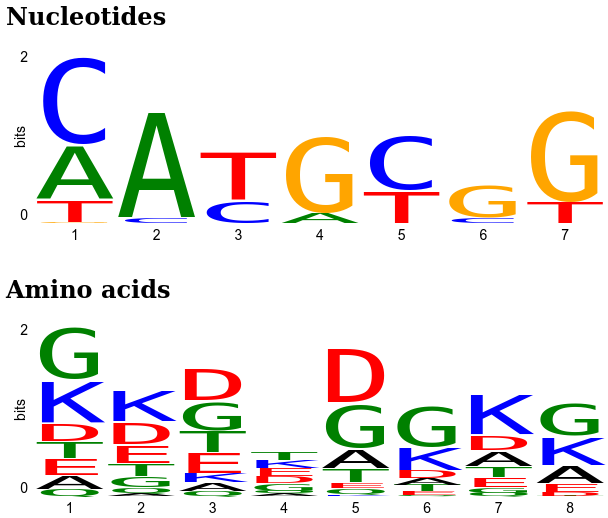

jseqlogo
========

Simple Javascript sequence logo library using pure Javascript.

## Usage

```html
<!DOCTYPE html>
<html lang="en">
    <body>
        <h2>Nucleotides</h2>
        <canvas id="logo_nt"></canvas>

        <h2>Amino acids</h2>
        <canvas id="logo_aa"></canvas>

        <script src="js/jseqlogo.js"></script>
        <script>
            var data = {
                "A": [0.5, 1.0, 0.0, 0.1, 0.0, 0.0, 0.0],
                "C": [0.8, 0.05, 0.2, 0.0, 0.5, 0.05, 0.0],
                "G": [0.01, 0.0, 0.0, 0.7, 0.0, 0.3, 0.84],
                "T": [0.2, 0.0, 0.45, 0.0, 0.3, 0.0, 0.2]
            };

            var options = {
                "colors": jseqlogo.colors.nucleotides
            };
            sequence_logo(document.getElementById("logo_nt"), 600, 200, data, options);

            var data = {
                "A": [0.174, 0.0384, 0.111, 0.0311, 0.238, 0.0826, 0.191, 0.224],
                "D": [0.231, 0.286, 0.422, 0.0904, 0.723, 0.097, 0.198, 0.0478],
                "E": [0.211, 0.229, 0.254, 0.0984, 0.0757, 0.0446, 0.126, 0.109],
                "G": [0.66, 0.135, 0.366, 0.0901, 0.565, 0.53, 0.063, 0.412],
                "Q": [0.0847, 0.0725, 0.0595, 0.0325, 0.0727, 0.0129, 0.0429, 0.0],
                "K": [0.542, 0.406, 0.117, 0.105, 0.0225, 0.293, 0.533, 0.359],
                "T": [0.212, 0.162, 0.276, 0.11, 0.176, 0.0809, 0.141, 0.00572],
            };

            var options = {
                "colors": jseqlogo.colors.aminoacids
            };
            sequence_logo(document.getElementById("logo_aa"), 600, 200, data, options);

        </script>
    </body>
</html>
```


